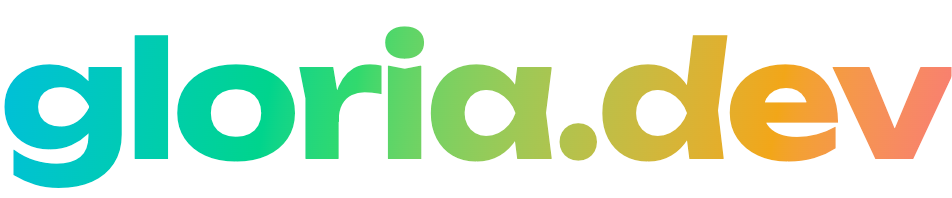

<p align="center">
  
</p>

<p align="center">
  <strong>Tools that help your agents — and humans — build the apps and write the code you want.<br>Build fearlessly; we've got the details.</strong>
</p>

---

This is the plugin marketplace for **[gloria.dev](https://gloria.dev)**. One repo serves three coding agents — [Claude Code](https://docs.claude.com/en/docs/claude-code/plugins), [OpenAI Codex](https://developers.openai.com/codex/plugins), and [OpenCode](https://opencode.ai) — from a single published source. Install the `gloria` plugin and your agent gets gloria.dev's skills plus the hosted gloria.dev MCP server.

## What is gloria.dev?

gloria.dev keeps an agent-written codebase aligned with intent. Agents write the code; gloria.dev makes sure it's the code you want. Each tool is driven by a project's own source code — continuously comparing what was actually built against what you intended, and surfacing where the two have drifted apart — so the picture stays current as the code changes.

Its first shipping tool is **Canary** — dependency monitoring. Canary discovers every internal and external dependency a project relies on, turns each one into a continuous health check, and notifies you the moment a dependency goes down, starts erroring more than usual, or gets unexpectedly expensive — _before_ your users or your vendor tell you. More tools are on the way: token cost tracking, coding standards, a living PRD, feature mapping, a skill marketplace, sub-agent management, and log debugging.

## What's in the `gloria` plugin

Installing the plugin gives your agent three skills and wires up the hosted MCP server.

| Skill                                  | What it does                                                                                                                      |
| -------------------------------------- | --------------------------------------------------------------------------------------------------------------------------------- |
| **`documenting-service-dependencies`** | Scans a codebase and produces dependency inventories plus copy-paste health-check definitions — the discovery step behind Canary. |
| **`identifying-skills-for-a-project`** | Inventories the agent skills a project already uses and recommends the gaps worth filling.                                        |
| **`using-the-skills-library`**         | Drives the gloria.dev skills library: search the org library before authoring a skill, and publish reusable skills org-wide.      |

The plugin also registers the remote **gloria.dev MCP server** at `https://mcp.gloria.dev/mcp` (Streamable HTTP). The agent uses it to register discovered dependencies as health checks and query their status. The server is OAuth-protected; the first request triggers a one-time browser sign-in.

## Install

Pick your agent. Each command below is run from inside that agent unless noted.

### Claude Code

```bash
/plugin marketplace add sandgardenhq/gloria
/plugin install gloria@gloria
```

The first command registers this marketplace; the second installs the `gloria` plugin (its skills plus the gloria.dev MCP server). Restart Claude Code if prompted. The first MCP call opens a one-time browser sign-in.

### OpenAI Codex

```bash
codex plugin marketplace add sandgardenhq/gloria   # in your shell
```

Then, inside Codex, run `/plugins` and install **gloria**. Finally, complete the one-time OAuth handshake with the remote MCP server:

```bash
codex mcp login gloria                             # in your shell
```

### OpenCode

OpenCode has no marketplace — add gloria.dev as a plugin in your `opencode.json` (global `~/.config/opencode/opencode.json` or a project-local `opencode.json`), then restart OpenCode:

```json
{ "plugin": ["gloria@git+https://github.com/sandgardenhq/gloria.git"] }
```

OpenCode installs the plugin, which registers gloria.dev's skills and the remote MCP server. The first MCP call opens a one-time browser sign-in. Pin a version with a git ref (`…/gloria.git#v0.1.7`).

## Once installed

Ask your agent to **document the project's service dependencies**. That invokes the `documenting-service-dependencies` skill, which produces the inventory and health-check definitions, then registers the resulting checks through the gloria.dev MCP server. From there, Canary runs the checks on a schedule and alerts you when a dependency drifts.

## Updating

| Agent        | Command                                                    |
| ------------ | ---------------------------------------------------------- |
| Claude Code  | `/plugin marketplace update gloria` then `/reload-plugins` |
| OpenAI Codex | `codex plugin marketplace upgrade gloria` (restart Codex)  |
| OpenCode     | `rm -rf ~/.cache/opencode/node_modules/gloria` and restart |

Third-party marketplaces have auto-update off by default in Claude Code — open `/plugin` → **Marketplaces** and enable auto-update for `gloria` to skip the manual step.

## Links

- Website — <https://gloria.dev>
- MCP server — <https://mcp.gloria.dev/mcp>

---

<p align="center"><sub>© Sandgarden, Inc. · gloria@sandgarden.com</sub></p>
